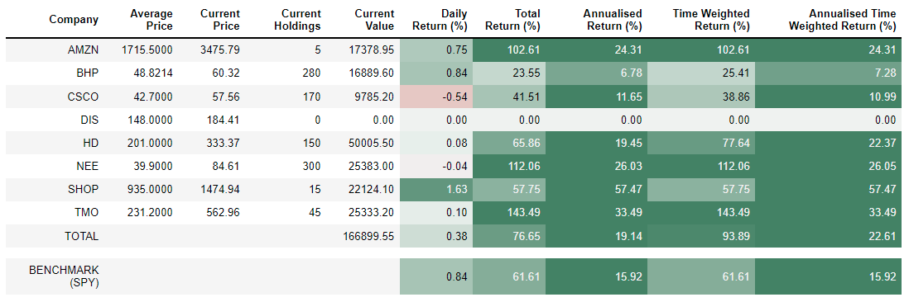
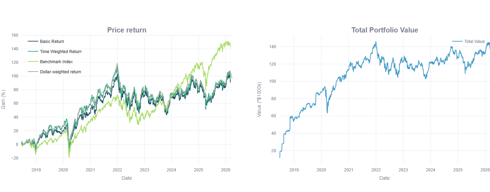
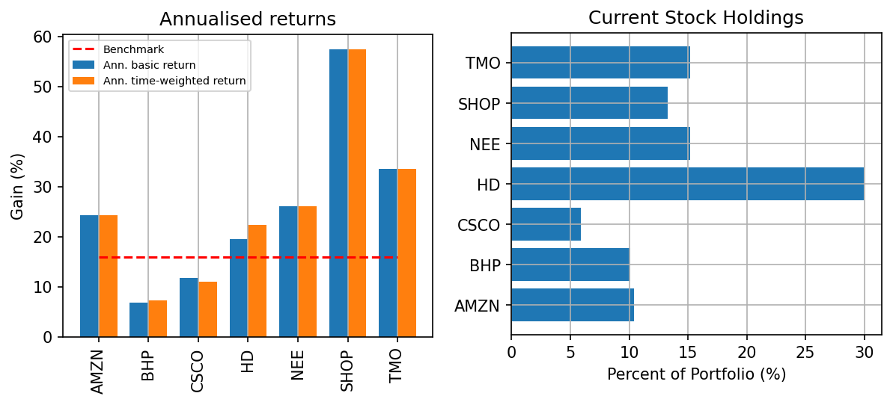

# Update March 2023
#### **Now deployable as a Streamlit app! **
https://thomaskillin-portfolio-tracker-streamlit-v1p5r9.streamlit.app/
#### **API key no longer required! **
 

 

Portfolio tracker tracks the perfomance of a portfolio of equities against a benchmark index.

The users equity portfolio should be saved locally as a csv file in the specified format.

Currently:

* Reads user portfolio data including stock purchases and sales
* Allows input of a reference stock ticker that can be used benchmark against portfolio performance
* Gets historical stock price data using the yfinance library
* Report a summary table of each stock holding, including current price, average price, daily and total % gain
* Plots portfolio gain metrics including Basic return and Time Weighted return (Modified Dietz return) aginst the return of the benchmark index
* Plots the percentage gain of each stock holding
* Plots the value of each stock holding as a percentage of the portfolio value
* Plots total portfolio value vs time
* Plots annualised returns

## Screenshots
  

## Contents
1. **Installation**
2. **Usage** 
3. **Dependencies**
4. **Metrics**

## 1. Installation

### Option 1: Streamlit App

https://thomaskillin-portfolio-tracker-streamlit-v1p5r9.streamlit.app/

### Option 2: Jupyter Notebook

1. This project runs as a Jupyter notebook. Installation details can be found here:
https://jupyter.org/install.html

2. Clone the repo from Github

3. Open the `<main.ipynb>` Jupyter notebook  
[Portfolio tracker Jupyter notebook](https://github.com/ThomasKillin/portfolio-tracker/blob/main/main.ipynb)

4. In the user input cell, input the file location of the share portfolio 
eg, `'filename = sample_portfolio.csv'` 
Input the ticker of a stock to compare the portfolio to (optional) 
The default is `index = 'SPY'` which is an index fund aiming to track the S&P500 index. 

5. Run all cells

## 2. Usage
 
A .csv file containing the user's stock portfolio data should be placed in the root directory of the repo.
The naming of the columns should be as follows: 

**Company:** Company stock ticker 
The stock ticker needs to recognised by Yahoo finance. If unsure, check on the Yahoo finance website. 
See here for valid exchange suffixes [Exchange suffixes](exchange_suffix.md) 
**Shares:** Number of shares bought or sold (negative number = sold) 
**Date:** Date in DD/MM/YYYY format 
**Price:** Price paid/received per share. 
**Adjustments:** (Optional column) This column allow for a cost base adjustment to be made. Eg, if a company restructure takes place, 
a portion of the cost base may be split into a new entity. The number entered into the '_Adjustments_' column represents
the portion of the cost base that is to be removed. I.e, a value of `-0.1` indicates a 10% reduction in the cost base. 

## 3. Dependencies

[Portfolio tracker requirements](https://github.com/ThomasKillin/portfolio-tracker/blob/main/requirements.txt)

## 4. Metrics

Some of the following metrics are used to characterise the portfolio:  
https://www.kitces.com/blog/twr-dwr-irr-calculations-performance-reporting-software-methodology-gips-compliance/  

1. **Basic return** 
The basic rate of return takes the gain for the portfolio and divides by the (original) investment amount
Cash flows are taken into account by assuming they occurred at the beginning of the investment period

2. **Time-weighted-return** 
A time-weighted return attempts to minimize or altogether remove the effects of interim cash flows.
Cash flows are weighted according to the amount of time they have been part of the portfolio

3. **Annualised returns** 
An annualized total return is the geometric average amount of money earned by an investment each 
year over a given time period. The annualized return formula is calculated as a geometric average 
to show what an investor would earn over a period of time if the annual return was compounded.

