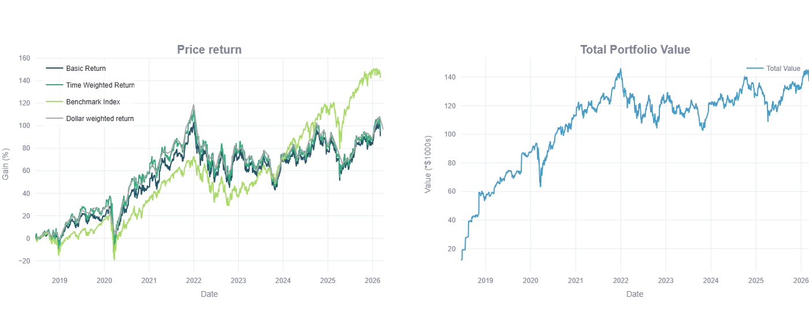
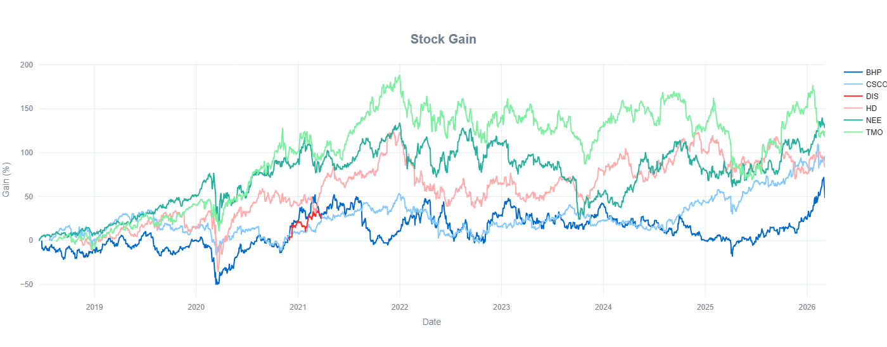
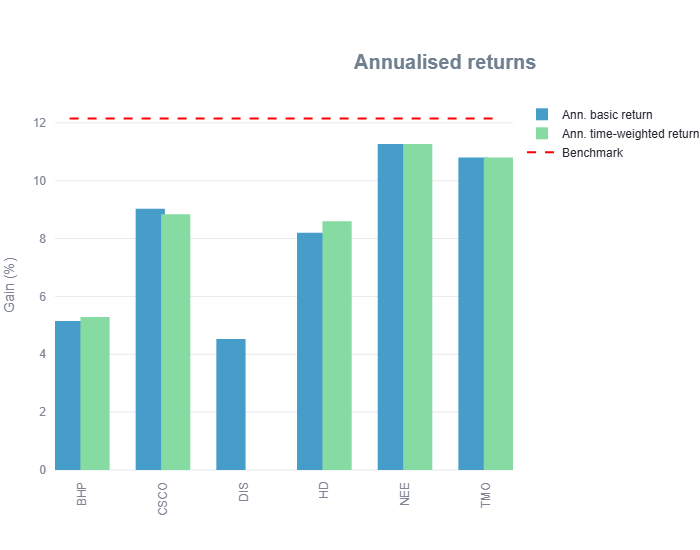
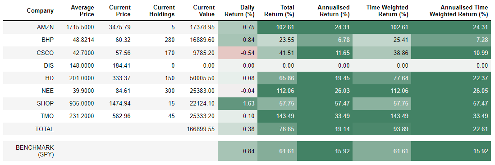
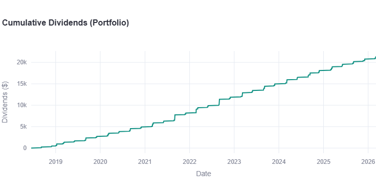
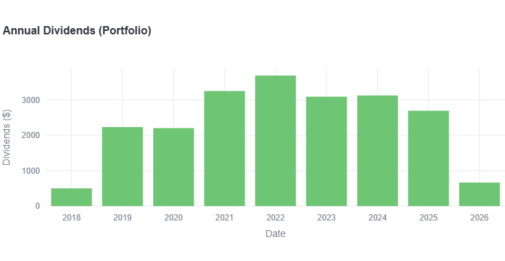
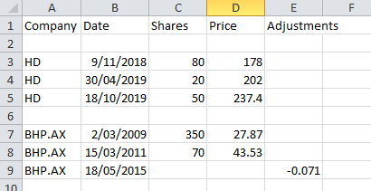

# Portfolio Tracker


Portfolio Tracker compares an equity portfolio against a benchmark and reports price-return and total-return performance.

## Live Demo
- Public Streamlit app: https://portfolio-tracker-pzhgdnwzfrt8lyl4m448ms.streamlit.app/

## Current status
- Primary UI: Streamlit (`streamlit.py`)
- Data provider (default): `yfinance`
- Notebook: `main.ipynb` is available and updated to current `share_tracking` APIs

## Features
- Portfolio upload from CSV (`Company`, `Date`, `Shares`, `Price`, optional `Brokerage`, `Adjustments`)
- Benchmark comparison (for example `^AXJO`, `^GSPC`, `SPY`)
- Price return and total shareholder return views
- Basic return, TWR, DWR, and annualized metrics
- Dividend metrics and dividend schedule tabs
- Dividend FY CSV export from Dividend Schedule
- Diagnostics tab for provider/FX/benchmark status
- Optional base-currency conversion with soft-fail warnings

## Screenshots







## Installation

### Python runtime
Primary target: Python 3.12  
Also commonly used in this repo: Python 3.11

### Setup (PowerShell)
```powershell
python -m venv .venv
.venv\Scripts\Activate.ps1
python -m pip install --upgrade pip
python -m pip install -r requirements.txt
python -m pip check
```

## Run

### Streamlit app (recommended)
```powershell
streamlit run streamlit.py
```

### Jupyter notebook (optional)
1. Install Jupyter: https://jupyter.org/install.html
2. Open `main.ipynb`
3. Update `filename` and `index` cells as needed
4. Run all cells

## Usage
A `.csv` file containing the user's stock portfolio data should be placed in the repo root (or uploaded in Streamlit).

The naming of the columns should be as follows:



- `Company`: Company stock ticker  
  The stock ticker needs to be recognized by Yahoo Finance.  
  If unsure, check Yahoo Finance directly.  
  See valid exchange suffixes in [exchange_suffix.md](exchange_suffix.md).
- `Shares`: Number of shares bought or sold (negative number = sold)
- `Date`: Date in `DD/MM/YYYY` format
- `Price`: Price paid/received per share
- `Brokerage` (optional): Transaction fee. Included in cost base and cash-flow calculations
- `Adjustments` (optional): Cost-base adjustment factor for events such as restructures/demergers.  
  Example: a value of `-0.1` indicates a 10% reduction in cost base.

Additional behavior:
- CSV column names are case-insensitive (`company`, `Company`, `ticker`, etc.)
- Multiple transactions for the same ticker on the same day are aggregated automatically
- Transaction dates must be business days

## Dependency workflow
- `requirements.in`: top-level dependencies
- `requirements.txt`: pinned lock set

Helper script:
```powershell
./scripts/deps.ps1 -Task install
./scripts/deps.ps1 -Task compile
./scripts/deps.ps1 -Task sync
./scripts/deps.ps1 -Task check
```

Validation:
```powershell
python -m pip check
python -m unittest -q
python -m py_compile streamlit.py share_tracking.py graphs.py performance_calcs.py
```

## Metrics
Some of the following metrics are used to characterize portfolio performance:

Reference methodology:  
https://www.kitces.com/blog/twr-dwr-irr-calculations-performance-reporting-software-methodology-gips-compliance/

1. `Basic return`  
   Gain divided by invested capital, with interim cash flows treated as if invested from period start.

2. `Total return`  
   Includes price return plus dividends (where dividend data is available).

3. `TWR (Time-Weighted Return)`  
   Reduces cash-flow timing effects by linking subperiod returns.

4. `DWR (Dollar-Weighted Return / IRR-style)`  
   Reflects return experienced by invested dollars, including timing and size of flows.

5. `Annualized columns (Ann.)`  
   Annualized equivalents of return metrics where applicable.

6. `Dividend metrics`  
   Includes cumulative dividends, trailing-12M dividends, dividend yield, TTM yield on cost, and lifetime dividend-to-cost ratio.

7. `Dividend schedule metrics`  
   Includes per-share dividend events, shares held on ex-date, dividend value in currency terms, and FY export support.

## References
- Return methodology background:  
  https://www.kitces.com/blog/twr-dwr-irr-calculations-performance-reporting-software-methodology-gips-compliance/
